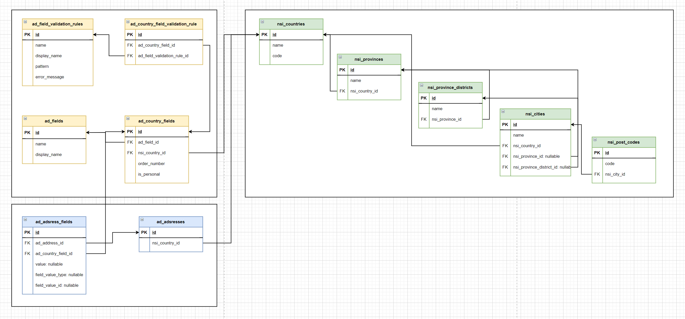

# Проект локализируемого ввода адреса 

## Введение

Приложение, используемое в разных странах должно не только поддерживать язык и форматы чисел, дат, валют и т.д., но и предоставлять ввод других данных в принятой в этой стране форме. К таким специальным данным относится адрес.

***

## Задание

В веб-приложении требуется универсальная форма для ввода адресов, которая автоматически меняется, в зависимости от того, в какой стране работает приложение. Форма меняет количество предлагаемых полей ввода. При вводе в некоторые поля должна выполняться предварительная проверка. Например, индекс в России может состоять только из 6-и цифр, а в Англии из двух буквенно-цифровых блоков по 3-4 символа. Также при вводе индекса приложение должно автоматически подставлять подходящий населённый пункт (или несколько), для чего должен храниться список соответствий в БД.

Предложите формат микросервиса в JSON, который бы позволял представить форму ввода национального адреса любой страны по указанным выше требованиям в веб-приложении.
Предложите структуру БД, в которой будет храниться вся необходимая информация об адресе, его формате и правилах ввода.

Важно! Ниже в документе описаны правила хранения персональных данных. Согласно этим правилам информация об адресе может быть удалена или анонимизирована — заменена случайными алфавитно-цифровыми строками. Приложение, БД и микросервис должны считать это состояние нормальным.
Часть информации об адресе должна сохраняться даже после удаления (например, индекс и город) для статистического анализа.

***

## Схема БД

Структура БД разделена на 3 блока
* Зеленый - справочные данные
* Желтый - поля для ввода адреса для каждой страны и набор правил валидации для каждого поля, а также типы данных относящиеся к персональным в данной стране
* Синий - результаты ввода данных адреса, значение поля может быть как текстовым, так и полиморфно ссылаться на справочные таблицы 

Полная версия в корне в db-schema.drawio

***

## Схема API

Схема API описана в корне проекта в api-schema.yml

***

## Установка проекта

```bash
./vendor/bin/sail up
```
или
```bash
./vendor/bin/sail up -d
```

Миграции
```bash
./vendor/bin/sail artisan migrate
```

[phpmyadmib](http://localhost:8184)


## License

[MIT license](https://opensource.org/licenses/MIT).
